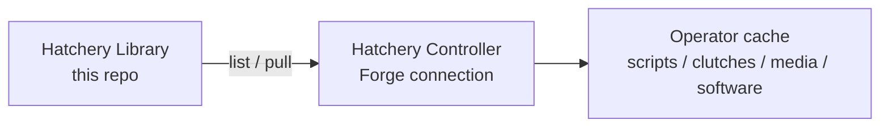

<br/><br/>

<div align="center">

<br/>

<picture>
  <source media="(prefers-color-scheme: dark)" srcset=".hatchery/branding/logos/hatchery-logo-dark.svg">
  
</picture>

<p><strong>Hatch. Provision. Scale.</strong></p>

<br/>


<br/>

</div>

<br/><br/>

---

**Hatchery Library** is a public sample catalog you add as a Hatchery **Forge** connection. Pull Scripts, Clutches, Media, and Software into the operator cache for demos, docs screenshots, and onboarding - without inventing your first repo.

Hatchery remains a **Library consumer** only. This repo is content; Hatchery does not push back to it.

---

<br/>

## What It Does

- **Scripts** - guest automation samples for Windows (PowerShell), Linux, and macOS (bash)
- **Clutches** - a demo Windows Clutch that references Library basenames after pull
- **Media** - a tiny ISO fixture for catalog demos, plus a slim VirtIO drivers ISO
- **Software** - offline MSI sample (`Hatchery.SoftwareExample.1.0.0`) plus YAML-only online samples (HTTPS download, winget, App Installer bootstrap, VirtIO guest tools)
- **Forge-ready** - path layout matches Hatchery binding filters for Scripts / Clutches / Media / Software

---

<br/>

## Add as a Forge connection

In Hatchery (Library enabled):

1. **Library → Connections** → Add
2. Type **Forge**, provider **GitHub**
3. Base URI: `https://github.com/dustinestes/Hatchery-Library` (or `dustinestes/Hatchery-Library`)
4. Token: optional for this public repo (helps with GitHub rate limits)
5. Kinds: scripts, clutches, media, software
6. Add bindings (filters below), **Test**, then pull from **Library → Content → Available**

### Suggested binding filters

| Domain | Filter | Notes |
|---|---|---|
| Answer Files | `*answerfiles/*` | Autounattend templates + `hatchery-setup-windows.ps1` |
| Scripts (Windows) | `scripts/windows/**/*.ps1` | PowerShell automations |
| Scripts (Linux) | `scripts/linux/**/*.sh` | bash automations |
| Scripts (macOS) | `scripts/macos/**/*.sh` | bash automations |
| Clutches | `clutches/**/*.yaml` | Demo Clutch YAML |
| Media (ISO) | `media/iso/**/*.iso` | Binding target **iso** |
| Media (VirtIO) | `media/virtio/**/*.iso` | Binding target **virtio** |
| Software | `*software/*` | Package units (dir with `software.yaml`) |

Public list/pull works without a PAT. Private forks need a token with contents read.

> Hatchery Library how-to → [library.md](https://github.com/dustinestes/Hatchery/blob/main/docs/library.md) in the Hatchery app repo

---

<br/>

## Layout

```text
answerfiles/
  windows/     Autounattend *.j2 + hatchery-setup-windows.ps1 companion
scripts/
  windows/     *.ps1
  linux/       *.sh
  macos/       *.sh
clutches/
  demo-windows.yaml
media/
  iso/         tiny.iso
  virtio/      virtio-win-0.1.285_slim.iso
software/
  Hatchery.SoftwareExample.1.0.0/          # offline MSI payloads
    software.yaml
    windows/{x86,x64,arm64}/…
  Microsoft.DesktopAppInstaller.1.29.380/  # YAML-only (HTTPS → winget)
  SoftwareFreedomConservancy.QEMUGuestAgent.110.0.2/  # YAML-only (winget)
  RedHat.VirtIO.0.1.285-1/                 # YAML-only (winget; no ISO)
  SPICE.GuestTools.0.141/                  # YAML-only (HTTPS → EXE)
```

### Basename rule

Hatchery identifies cache files by **basename + SHA-256**. Directories are dropped on pull for Scripts / Clutches / Media. Every file in those domains has a **unique basename** (OS suffixes: `-windows`, `-linux`, `-macos`) so Linux and macOS scripts do not collide in `automation/scripts/`.

**Software** is different: Hatchery catalogs and pulls **package units** (a directory containing `software.yaml`), preserving the whole tree under `automation/software/{id}/`.

Do not add two Scripts/Clutches/Media files that share the same leaf name under different folders.

---

<br/>

## Scripts

| Concern | Windows | Linux | macOS |
|---|---|---|---|
| Template | `hatchery-script-template-windows.ps1` | `hatchery-script-template-linux.sh` | `hatchery-script-template-macos.sh` |
| Hostname + timezone | `configure-vm-basics-windows.ps1` | `configure-vm-basics-linux.sh` | `configure-vm-basics-macos.sh` |
| Remote access | `enable-rdp-windows.ps1` | `enable-ssh-linux.sh` | `enable-ssh-macos.sh` |
| Nest SSH authorize | `authorize-hatchery-nest-ssh-windows.ps1` | - | - |
| Nest Hyper-V role | `enable-hyperv-windows.ps1` | - | - |
| Guest tools | `install-virtio-drivers-windows.ps1` | `install-qemu-guest-agent-linux.sh` | - |
| Package cleanup | `remove-appx-windows.ps1` | - | - |
| Hatchery cleanup | `hatchery-cleanup-windows.ps1` | `hatchery-cleanup-linux.sh` | `hatchery-cleanup-macos.sh` |
| Retry demo | `hatchery-testretry-windows.ps1` | `hatchery-testretry-linux.sh` | `hatchery-testretry-macos.sh` |

**Nest-prep (Windows Hyper-V Nest):** `authorize-hatchery-nest-ssh-windows.ps1` detects OpenSSH via ARP (MSI) or FoD capability (never overlays MSI on FoD; never `Add-WindowsCapability`); if missing, bootstraps the same GitHub Win64 MSI as `hatchery-setup-windows.ps1`, then ensures `sshd`/firewall and appends a Controller remoting identity pubkey (`-PublicKey` or `-PublicKeyPath`). `enable-hyperv-windows.ps1` enables the Hyper-V role (reboot may be required). Operator how-to: Hatchery [Getting Started - Remote Nest](https://github.com/dustinestes/Hatchery/blob/main/docs/getting-started.md) and [Nest SSH](https://github.com/dustinestes/Hatchery/blob/main/docs/nest-ssh.md) (Hatchery [#548](https://github.com/dustinestes/Hatchery/issues/548) / [#260](https://github.com/dustinestes/Hatchery/issues/260)).

Retry demos write a flag under the guest OS temp directory (`$env:TEMP` on Windows, `/tmp` on Linux/macOS), exit `1` on the first run, then succeed on Hatchery retry.

**Windows first-boot UAC (lab/dev):** `answerfiles/windows/hatchery-setup-windows.ps1` sets UAC to Never notify so silent Software installs work over Guest transport (Hatchery [#543](https://github.com/dustinestes/Hatchery/issues/543)). That is weaker than the default Windows slider; it is intentional for reliable `msiexec /qn` in hatches. `hatchery-cleanup-windows.ps1` restores the prior values (or Windows defaults) before wiping the Hatchery guest root (`HATCHERY_ROOT`). Controllers with a cached pull must re-pull Answer Files and Scripts to pick this up.

---

<br/>

## Clutch, media, and software

| Path | Role |
|---|---|
| `clutches/demo-windows.yaml` | Single-VM sample Clutch (Library shopping) |
| `media/iso/tiny.iso` | 50-byte fixture for Available / pull / provenance demos - **not** a bootable Windows image |
| `media/virtio/virtio-win-0.1.285_slim.iso` | Slim VirtIO drivers ISO (~29MB) for Media → VirtIO bindings |
| `software/Hatchery.SoftwareExample.1.0.0/` | Offline multi-arch MSI sample |
| `software/Microsoft.DesktopAppInstaller.1.29.380/` | YAML-only: HTTPS bootstrap of winget (opt-in) |
| `software/SoftwareFreedomConservancy.QEMUGuestAgent.110.0.2/` | YAML-only: `winget` qemu-ga **only** (also nested inside `RedHat.VirtIO`) |
| `software/RedHat.VirtIO.0.1.285-1/` | YAML-only: `winget` full virtio-win-guest-tools Burn (drivers + qemu-ga; no ISO) |
| `software/SPICE.GuestTools.0.141/` | YAML-only: HTTPS download + silent EXE |

Replace `os_media` in the demo Clutch with a real Windows eval ISO before hatching a guest. VirtIO attribution: [NOTICE.md](NOTICE.md).

### Software YAML shapes

Same schema everywhere (`platforms.{os}.{arch}` + install / uninstall / detect). Payload dirs under `{os}/{arch}/` are **optional**. Full contract: Hatchery [docs/software.md](https://github.com/dustinestes/Hatchery/blob/main/docs/software.md) ([#471](https://github.com/dustinestes/Hatchery/issues/471) / [#561](https://github.com/dustinestes/Hatchery/issues/561)).

**1. Offline payload** (`Hatchery.SoftwareExample.1.0.0`) - MSI/EXE files next to `software.yaml`; hatch stages `windows/{arch}/` then runs `msiexec` / relative EXE.

**2. HTTPS download** (`SPICE.GuestTools.0.141`) - yaml only; `install.command` downloads a known URL on the guest and runs the installer.

**3. Winget** - yaml only; `install.command` calls `winget install …`. Put `Microsoft.DesktopAppInstaller.1.29.380` earlier in Clutch `automations` when the guest lacks App Installer (not baked into hatchery-setup).

- `RedHat.VirtIO.0.1.285-1` - **full** virtio-win-guest-tools Burn (drivers MSI + qemu-ga nested; post-install, no ISO). Setup-time `viostor` still wants media attached.
- `SoftwareFreedomConservancy.QEMUGuestAgent.110.0.2` - **individual** qemu-ga only; skip if `RedHat.VirtIO` is already selected (Burn uninstall removes nested agent).

Never use `exit [int]$LASTEXITCODE` after a native installer (`[int]$null` is `0`). Check null, then `exit $LASTEXITCODE` (Hatchery [#546](https://github.com/dustinestes/Hatchery/issues/546)).

```yaml
# Offline (payload tree present)
platforms:
  windows:
    x64:
      install:
        command: |
          msiexec.exe /i $env:HATCHERY_SOFTWARE_PACKAGE\Setup.msi /qn /norestart
          if ($null -eq $LASTEXITCODE) {
            Write-Error 'msiexec produced no exit code'
            exit 255
          }
          exit $LASTEXITCODE
      uninstall: { command: '…' }
      detect: { command: '…' }

# Online HTTPS (no windows/x64/ dir)
platforms:
  windows:
    x64:
      install:
        command: |
          Invoke-WebRequest -Uri 'https://example.invalid/Setup.exe' -OutFile $env:TEMP\Setup.exe
          cmd.exe /c "$env:TEMP\Setup.exe /S"
      uninstall: { command: '…' }
      detect: { command: '…' }

# Online winget (no windows/x64/ dir)
platforms:
  windows:
    x64:
      install:
        command: |
          winget install -e --id Publisher.Product --source winget --silent --accept-package-agreements --accept-source-agreements
      uninstall: { command: '…' }
      detect: { command: '…' }
```

Pull with binding filter `*software/*`. Offline packages: hatch stages only the guest-arch subtree ([#474](https://github.com/dustinestes/Hatchery/issues/474)). Online packages: zero files staged; the guest command does the work.

---

<br/>

## What It's Made For



One public Forge repo seeds demos. Operators pull what they need and leave the rest.

---

<br/>

## Related

- **Hatchery app** → [dustinestes/Hatchery](https://github.com/dustinestes/Hatchery)
- **Library feature** → [docs/library.md](https://github.com/dustinestes/Hatchery/blob/main/docs/library.md)
- **Issue** → [#315](https://github.com/dustinestes/Hatchery/issues/315)

---

<br/>

## How It's Licensed

MIT License for original content in this repository. See [LICENSE](LICENSE).

The VirtIO ISO is upstream **virtio-win** content - see [NOTICE.md](NOTICE.md).

---

<br/>

## With Thanks To

- **Dustin Estes** - creator, product design, and development
- **Fedora / virtio-win** - guest drivers ISO used for Media demos

<br>

---

<picture>
  <source media="(prefers-color-scheme: dark)" srcset=".hatchery/branding/logos/hatchery-logo-dark.svg">
  
</picture>
<div align="right">Hatch. Provision. Scale.</div>
<br clear="both">
