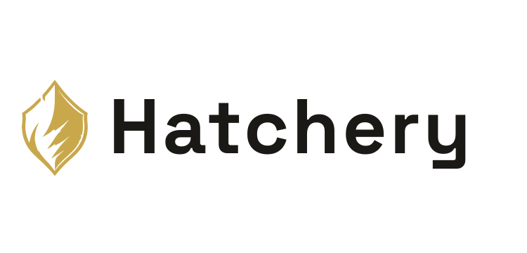
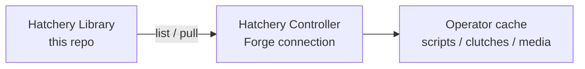

<br/><br/>

<div align="center">

<br/>

<picture>
  <source media="(prefers-color-scheme: dark)" srcset=".hatchery/branding/logos/hatchery-logo-dark.svg">
  
</picture>

<p><strong>Hatch. Provision. Scale.</strong></p>

<br/>


<br/>

</div>

<br/><br/>

---

**Hatchery Library** is a public sample catalog you add as a Hatchery **Forge** connection. Pull Scripts, Clutches, and Media into the operator cache for demos, docs screenshots, and onboarding - without inventing your first repo.

Hatchery remains a **Library consumer** only. This repo is content; Hatchery does not push back to it.

---

<br/>

## What It Does

- **Scripts** - guest automation samples for Windows (PowerShell), Linux, and macOS (bash)
- **Clutches** - a demo Windows Clutch that references Library basenames after pull
- **Media** - a tiny ISO fixture for catalog demos, plus a slim VirtIO drivers ISO
- **Forge-ready** - path layout matches Hatchery binding filters for Scripts / Clutches / Media

---

<br/>

## Add as a Forge connection

In Hatchery (Library enabled):

1. **Library → Connections** → Add
2. Type **Forge**, provider **GitHub**
3. Base URI: `https://github.com/dustinestes/Hatchery-Library` (or `dustinestes/Hatchery-Library`)
4. Token: optional for this public repo (helps with GitHub rate limits)
5. Kinds: scripts, clutches, media
6. Add bindings (filters below), **Test**, then pull from **Library → Content → Available**

### Suggested binding filters

| Domain | Filter | Notes |
|---|---|---|
| Scripts (Windows) | `scripts/windows/**/*.ps1` | PowerShell automations |
| Scripts (Linux) | `scripts/linux/**/*.sh` | bash automations |
| Scripts (macOS) | `scripts/macos/**/*.sh` | bash automations |
| Clutches | `clutches/**/*.yaml` | Demo Clutch YAML |
| Media (ISO) | `media/iso/**/*.iso` | Binding target **iso** |
| Media (VirtIO) | `media/virtio/**/*.iso` | Binding target **virtio** |

Public list/pull works without a PAT. Private forks need a token with contents read.

> Hatchery Library how-to → [library.md](https://github.com/dustinestes/Hatchery/blob/main/docs/library.md) in the Hatchery app repo

---

<br/>

## Layout

```text
scripts/
  windows/     *.ps1
  linux/       *.sh
  macos/       *.sh
clutches/
  demo-windows.yaml
media/
  iso/         tiny.iso
  virtio/      virtio-win-0.1.285_slim.iso
```

### Basename rule

Hatchery identifies cache files by **basename + SHA-256**. Directories are dropped on pull. Every file in this repo has a **unique basename** (OS suffixes: `-windows`, `-linux`, `-macos`) so Linux and macOS scripts do not collide in `automation/scripts/`.

Do not add two files that share the same leaf name under different folders.

---

<br/>

## Scripts

| Concern | Windows | Linux | macOS |
|---|---|---|---|
| Template | `hatchery-script-template-windows.ps1` | `hatchery-script-template-linux.sh` | `hatchery-script-template-macos.sh` |
| Hostname + timezone | `configure-vm-basics-windows.ps1` | `configure-vm-basics-linux.sh` | `configure-vm-basics-macos.sh` |
| Remote access | `enable-rdp-windows.ps1` | `enable-ssh-linux.sh` | `enable-ssh-macos.sh` |
| Guest tools | `install-virtio-drivers-windows.ps1` | `install-qemu-guest-agent-linux.sh` | - |
| Package cleanup | `remove-appx-windows.ps1` | - | - |
| Hatchery cleanup | `hatchery-cleanup-windows.ps1` | `hatchery-cleanup-linux.sh` | `hatchery-cleanup-macos.sh` |
| Retry demo | `hatchery-testretry-windows.ps1` | `hatchery-testretry-linux.sh` | `hatchery-testretry-macos.sh` |

Retry demos write a flag under the guest OS temp directory (`$env:TEMP` on Windows, `/tmp` on Linux/macOS), exit `1` on the first run, then succeed on Hatchery retry.

---

<br/>

## Clutch and media

| Path | Role |
|---|---|
| `clutches/demo-windows.yaml` | Single-VM sample Clutch (Library shopping) |
| `media/iso/tiny.iso` | 50-byte fixture for Available / pull / provenance demos - **not** a bootable Windows image |
| `media/virtio/virtio-win-0.1.285_slim.iso` | Slim VirtIO drivers ISO (~29MB) for Media → VirtIO bindings |

Replace `os_media` in the demo Clutch with a real Windows eval ISO before hatching a guest. VirtIO attribution: [NOTICE.md](NOTICE.md).

---

<br/>

## What It's Made For



One public Forge repo seeds demos. Operators pull what they need and leave the rest.

---

<br/>

## Related

- **Hatchery app** → [dustinestes/Hatchery](https://github.com/dustinestes/Hatchery)
- **Library feature** → [docs/library.md](https://github.com/dustinestes/Hatchery/blob/main/docs/library.md)
- **Issue** → [#315](https://github.com/dustinestes/Hatchery/issues/315)

---

<br/>

## How It's Licensed

MIT License for original content in this repository. See [LICENSE](LICENSE).

The VirtIO ISO is upstream **virtio-win** content - see [NOTICE.md](NOTICE.md).

---

<br/>

## With Thanks To

- **Dustin Estes** - creator, product design, and development
- **Fedora / virtio-win** - guest drivers ISO used for Media demos

<br>

---

<picture>
  <source media="(prefers-color-scheme: dark)" srcset=".hatchery/branding/logos/hatchery-logo-dark.svg">
  
</picture>
<div align="right">Hatch. Provision. Scale.</div>
<br clear="both">
